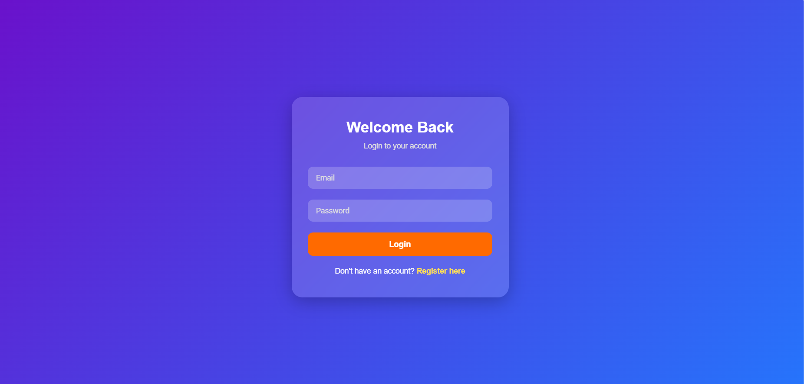
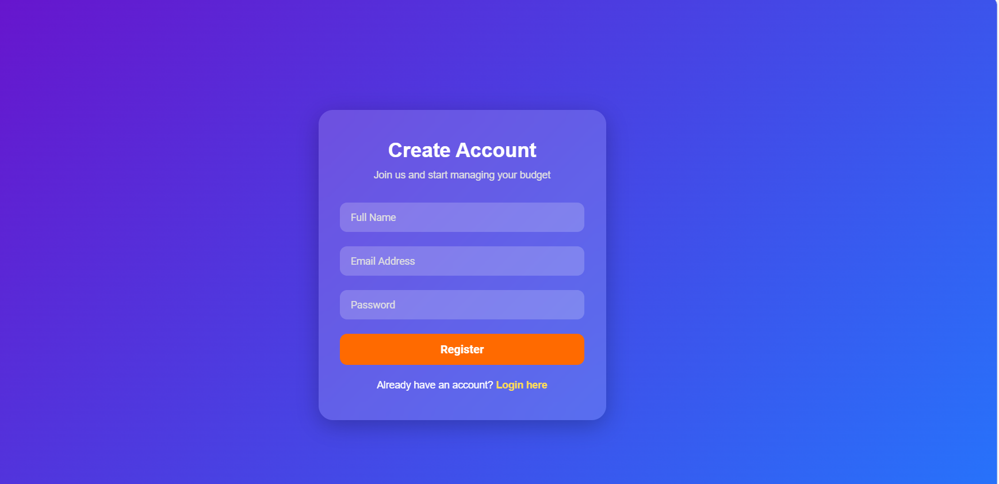
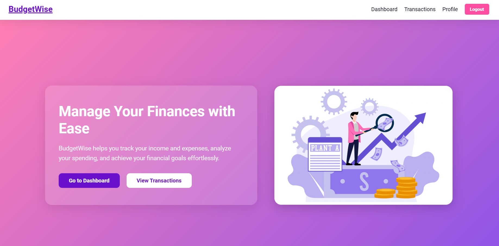
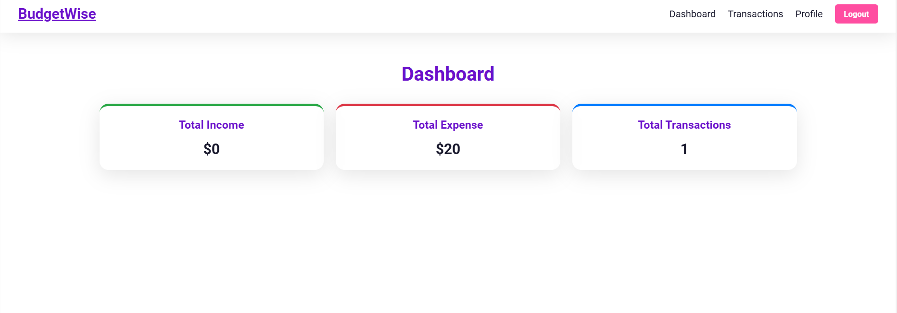
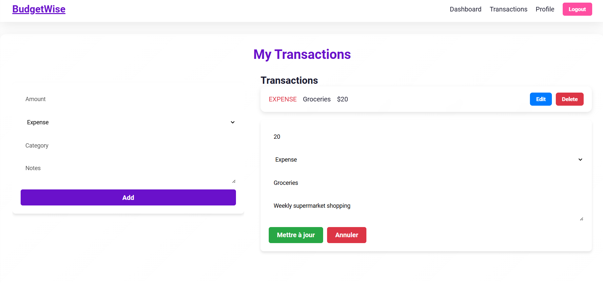
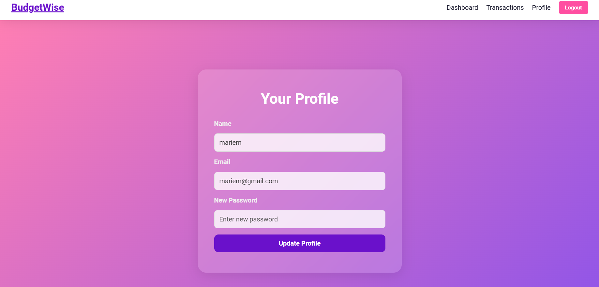

# 💰 BudgetWise – MERN Project

**BudgetWise** is a **personal finance management application** that allows users to **track income and expenses**, **categorize transactions**, and **analyze their spending habits**.  
It provides **role-based dashboards**, a **transactions system**, **profile management**, and a **financial overview** to help users make smart financial decisions.

Built with the **MERN Stack** (**MongoDB**, **Express.js**, **React**, **Node.js**), BudgetWise helps users efficiently manage their finances in one place.

---

## 📑 Table of Contents

- [Features](#features)
- [Installation](#installation)
- [Configuration](#configuration)
- [Usage](#usage)
- [Project Structure](#project-structure)
- [Technologies Used](#technologies-used)
- [Screenshots](#screenshots)

---

## ✨ Features

### 👤 User Features

- **📊 Dashboard** – Overview of income, expenses, and financial stats
- **💸 Transactions Management** – Add, edit, and delete income/expense transactions
- **📂 Transaction Categories** – Organize transactions by category
- **📝 Notes** – Add notes to transactions for detailed tracking
- **👤 Profile Management** – View and update personal information, change password
- **📈 Financial Overview** – Charts and summaries for spending and savings trends
- **🔔 Alerts** – Simple notifications for important actions or errors

---

## 📸 Screenshots

### Login



### Register



### Home



### Dashboard



### Transactions Page



### Profile Page



---

## ⚙ Installation

### Prerequisites

- **Node.js** (v14+ recommended)
- **MongoDB** (v4+)
- **npm** or **yarn**

### Steps

1. **Clone the repository**

```bash
git clone https://github.com/MariemSoualhia/BudgetWise-MERN-Project.git
cd budgetwise-mern-project
```

2. Install dependencies

   Backend

   ```
   cd backend
   npm install
   ```

   Frontend

   ```
   cd ../frontend
   npm install
   ```

## ⚙ Configuration

Create a .env file inside the backend folder with the following variables:

```
MONGO_URI=mongodb://localhost:27017/budget-app
JWT_SECRET=your_jwt_secret_key
PORT=5000
```

### 🚀 Usage

1. Start the backend server

```
cd backend
npm strat
```

2. Start the frontend app

```
cd ../frontend
npm start

```

By default, the backend runs on http://localhost:5000 and the frontend on http://localhost:3000.
